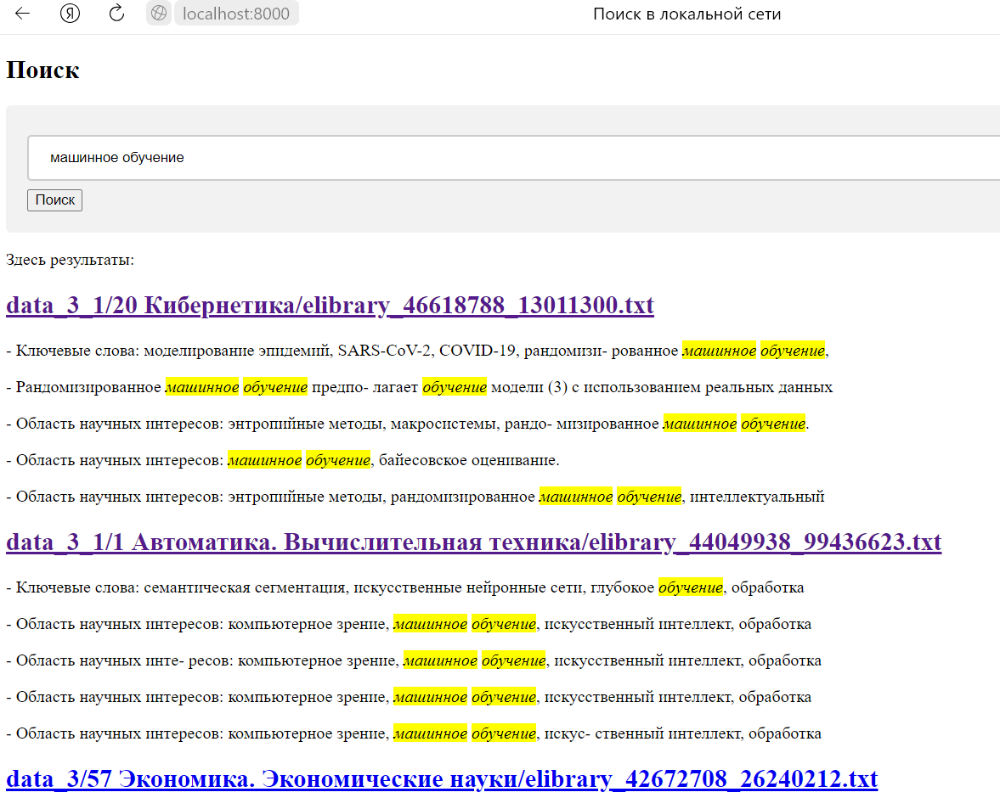

Поисковик для локальной сети (Версия 5)




# Установка

Должен быть установлен git (см. https://git-scm.com/).
```
> git clone https://github.com/prog815/LS5.git
```


# Запуск

Перейти в папку проекта.
```
> cd LS5
```

Запустить проект. Должен быть установлен Docker (см. https://www.docker.com/).
```
> docker-compose up -d
```


# Остановка

```
> docker-compose down 
```